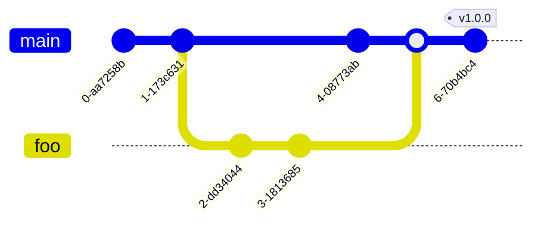

# New Post about a thing or something
## Cool stuff
```cpp
int main() {
  std::string apple = "cool";
}
```
```bash
cd ~
ls -la
```
### Diagrams

```mermaid
gitGraph
commit
commit
branch foo
checkout foo
commit
commit
checkout main
commit
merge foo
commit tag: "v1.0.0"
```


```mermaid
gitGraph
commit
commit
branch foo
checkout foo
commit
commit
checkout main
commit
merge foo
commit tag: "v1.0.0"
```